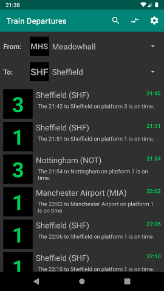
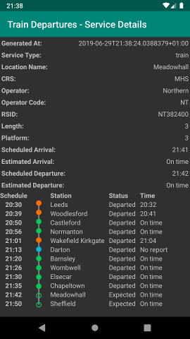
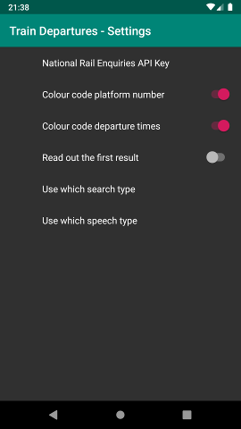

# Playground Kotlin + Android

Test project for Kotlin and Android  

 
## Screenshots
 
 
 

## Sources
 - https://github.com/JetBrains/kotlinconf-app
 - https://developer.android.com/kotlin/
 - https://developer.android.com/kotlin/ktx#ktx
 - https://docs.travis-ci.com/user/languages/android/
 - http://www.nationalrail.co.uk/46391.aspx

